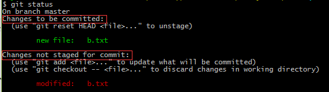

[TOC]

# Git 基本介绍

> 本章节重点讲解Git的原理和Git的使用方法。通过本章的学习，可以清楚了解Git是如何工作的以及怎样使用Git。

## 参考资料

[一步一步的观察Git执行过程](http://blog.xiayf.cn/2013/09/28/learning-git-internals-by-example/)

[大而全的Git学习资料](https://github.com/xirong/my-git)

[廖雪峰的Git教程](http://www.liaoxuefeng.com/wiki/0013739516305929606dd18361248578c67b8067c8c017b000)

## 基本概念 

### 版本库（Repository）、暂存区（Stage）、工作空间（Working Directory）

作为分布式版本管理系统Git，有三个最为核心的概念：版本库、暂存区和工作空间。

+ **工作空间（Working Directory）**：工作空间是用来存放需要管理的内容，可能是用户编写的代码、文档等等。
+ **版本库（Repository）**：和工作空间的同级目录中有一个`.git`文件夹，这个文件夹就是git的版本库。版本库里存放很多管理信息，如暂存区（index）、日志（logs）、所有的引用（refs）等，是管理控制系统的核心。
+ **暂存区（Stage）**：在版本库下的名为`index`的文件。暂存区用来存储工作空间内的文件的修改。


这三个区是如何进行交互的呢？

1. 通过`git add`命令将工作区内的修改（增删改）提交到暂存区；
2. 通过`git commit`命令将暂存区的内容提交到当前分支；
3. 通过`git push`命令将仓库的当前分支提交到远程仓库中。

既然版本库是git的核心，下面我们就详细讲讲版本库的内容。

#### 版本库（Repository）

版本库即为.git文件夹存储的内容，我们将通过分析.git文件夹的内容来分析版本库。.git文件夹如下所示：


+ **HEAD**：头指针用来指向当前工作区的最新版本。后面用户的修改都是基于当前HEAD指针指向的版本的修改。通过引入HEAD指针，用户可以方便的进行版本控制，例如当需要版本回退时，只需要将指针移动到对应的版本即可。在本实例中，HEAD的内容如下：`ref: refs/heads/master`，它指向了refs文件夹下的heads文件夹下的master。更多详细的关于HEAD的定位，请参考本章节中的[Q1: Git HEAD是如何定位的](#Q1: Git HEAD是如何定位的？)。

+ **refs**：存放了git的所有的引用，包括头指针、远程仓库指针以及标签等，方便快速定位当前的版本（包括本地的，远程的和tag）指向哪里。它的组织结构如下所示：

  

  + **heads**： 存放本地各个分支的头指针，该指针指向该本地分支的工作空间内的当前版本，采用SHA-1数值标识。例如该工作空间有两个分支：master和test，master文件内容为`bb840425661b0befe1b00305d87d4b6244ff5e62`，它标识了当前master分支的版本，test同理。
  + **remotes**：存放远程各个分支的头指针，该指针指向该远程分支的工作空间内的当前版本，也是采用SHA-1数值标识，例如在远程仓库origin中有两个分支：master和test，master文件内容为`bb840425661b0befe1b00305d87d4b6244ff5e62`，它标识了当前master的版本，test同理，我们发现这两个版本相同，说明本地仓库和远程仓库的内容是一致的。（严格来讲，这里所说的一致是指截止到上次提交时，这两个仓库的内容是一样的，还有可能存在本地已经修改而且提交到暂存区，但是还没有提交到本地仓库，这是暂存区的内容和远程仓库的内容就不是一致的了）。
  + **tags**：描述当前仓库的tag信息，也是采用SHA-1数值标识。例如在该空间中有两个tag：v0.9和v1.0，我们打开v1.0，其存储内容为`bb840425661b0befe1b00305d87d4b6244ff5e62`，这与前面master内容一致，说明是在该版本上打的tag。

+ **logs**：用户提交时的日志记录都在logs文件夹中，用户可以通过`git log`命令来查看之前提交的日志记录。该文件夹的组织形式如下：

  

  + **HEAD**：所有提交的日志记录都在这里，按照如下方式来组织：

  ```
  0000000000000000000000000000000000000000 3456c135ef07f3418d8577e0bfd137349b4e6e60 DuanSky <duansky22@163.com> 1496641940 +0800	commit (initial): first commit
  3456c135ef07f3418d8577e0bfd137349b4e6e60 bb840425661b0befe1b00305d87d4b6244ff5e62 DuanSky <duansky22@163.com> 1496913492 +0800	commit: 完成Maven手册的编写
  bb840425661b0befe1b00305d87d4b6244ff5e62 bb840425661b0befe1b00305d87d4b6244ff5e62 DuanSky <duansky22@163.com> 1497260029 +0800	checkout: moving from master to test
  ```

  ​	文件中的每一行代表一次提交的日志记录，每一次的提交日志由（上次提交的SHA-1值，本次提交的SHA-1值，本次提交作者，本次提交账号，本次提交时间、时区，提交信息）这七部分组成，在本实例中总共有三次提交记录。

  + **refs**：存储着本地（heads文件夹）和远程（remotes文件夹）的提交日志记录。例如在heads文件夹中有master和test两个文件，master文件存储的是master分支的所有提交日志记录，其内容的组织形式和HEAD文件的组织形式相同，内容如下所示：

  ```
  0000000000000000000000000000000000000000 3456c135ef07f3418d8577e0bfd137349b4e6e60 DuanSky <duansky22@163.com> 1496641940 +0800	commit (initial): first commit
  3456c135ef07f3418d8577e0bfd137349b4e6e60 bb840425661b0befe1b00305d87d4b6244ff5e62 DuanSky <duansky22@163.com> 1496913492 +0800	commit: 完成Maven手册的编写
  ```

+ **index**：即所谓的暂存区，是一个二进制文件，用户通过`git add`命令将工作空间内的改动添加到暂存区中。

+ **objects**：Git中存放实体的地方，所谓的实体，就是仓库中被管理的文件。Git将其以二进制的形式存储在objects中，并通过refs来标识。文件夹组织结构如下图所示：


完整的.git文件夹内容如下所示：


#### 暂存区（Stage）

​	通过前面的讲述我们知道通过`git add`命令能够将工作空间修改的内容添加到暂存区，然后再通过`git commit`命令将暂存区中的内容全部提交给仓库，我们在使用`git status`命令时，常常发现文件会有如下几种类型：

1. 未被跟踪的文件（Untracked files）--> 用户新建的之前从来没有添加到暂存区的文件
2. 被修改但未被暂存的文件（Changes not staged for commit）--> 用户之前添加过暂存区的但是又在工作空间修改了没有提交到暂存区的文件
3. 已暂存可以被提交的文件（changes to be committed） --> 已经添加到暂存区中可以被提交的文件
4. 自上次提交以来未修改的文件（clean）--> 没有文件被改动而且暂存区也为空

​        需要注意的是第一种文件一般是用户新建的文件，这些文件之前也没有添加到暂存区，所以是无法追踪的；而第二种文件是之前已经存在的用户修改的但没有添加到暂存区的文件，是可以追踪的。如果结合版本库、暂存区和工作空间来看，文件的状态转换如下：


​	用户在工作空间中新增加文件（例如新增加 a.txt）会被定义为`Untracked files`，用户修改原来已经添加到仓库的文件（例如README）会被定义为`changes not staged for commit`，这两种文件都是用户修改的但未被添加到暂存区中的文件；通过使用`git add`命令之后，这些文件会被添加到暂存区中，此时文件的状态为`changes to be committed`，表示这些文件已经准备被提交到仓库中了；通过使用`git commit`命令，这些文件会被添加到仓库中，完成了整个过程，此时这些文件的状态为`clean`，很"干净"，所有的修改都已经提到到仓库了。

这些文件类型本质上是对应了4种状态：

+ untracked：还没添加到仓库中。

+ modified：已经在工作空间中修改但还没添加到暂存区中。

+ staged：已经添加到暂存区但还没提交到仓库中。

+ unmodified：自上次提交以来，文件未曾修改过。

  这四种状态的转换如下： 


​	上述讲述了一个文件从工作区到暂存区再到最后的仓库中的整个流程，是一个正常的文件状态转换过程。那么考虑这样一种情况，如果我修改了某个已经提交到暂存区的文件，此时整个文件的状态是什么呢？

（1）创建一个文件”b.txt"，此时使用`git status`会显示这个文件是`Untracked files`，如下图所示：


（2）使用`git add`命令将这个文件添加到暂存区中，此时这个文件的状态为`changes to be committed`，如下图所示：


（3）使用`touch "b" >> b.txt`命令向b.txt文件中新增加内容，然后使用`git status`命令，此时文件的状态如下所示，我们发现这个文件有两个状态：`changes to be committed`和`changes not staged for commit`。第一个状态是我们在第二步中`git add`命令添加到暂存区中的文件b.txt，第二个状态是我们又修改了但还没有被添加到暂存区中的文件b.txt，实际上这两个状态都是一个文件；为什么会有两个状态呢？这是因为每次执行`git add`添加文件到暂存区时，它都会把文件内容进行SHA1哈希运算，在索引文件中新加一项，再把文件内容存放到本地的objects里。如果在上次执行 `git add`之后再对文件的内容进行了修改，那么在执行`git status`命令时，Git会对文件内容进行SHA1哈希运算就会发现文件又被修改了，这时“b.txt“就同时呈现了两个状态：被修改但未被暂存的文件（changed but not updated），已暂存可以被提交的文件（changes to be committed）。如果我们这时提交的话，就是只会提交第一次`git add`所以暂存的文件内容。



​	我们知道了暂存区里面存放了与当前暂存内容相关的信息，包括暂存的文件名、文件内容的SHA1哈希串值和文件访问权限，整个索引文件的内容以暂存的文件名进行排序保存的。关于暂存区的常用命令有如下几个：

```
$ git add filename 将文件添加到暂存区
$ git ls-files --stage 查看暂存区中的所有文件
$ git rm --cached filename 删除暂存区中的filename文件
```


### 实体（Objects）、引用（References）、索引（index）

​	如果说版本库、暂存区和工作空间是从宏观的角度描述git的工作过程，那么实体、引用和索引是从微观的角度描述git的工作过程。下面我们将重点阐述这三者之间的关系以及他们是如何进行交互的。他们三者的关系如下图所示：


+ **实体（Object）**：提交到一个Git代码仓库中的所有文件，包括每个提交的说明信息（the commit info）都在目录 `.git/objects/`中存储为**实体**。一个实体用一个长度为40个字符长度的SHA-1哈希值来标识。按照实体类型的不同，一般有如下四类：

  + **blob**：存储文件的内容，用户每次通过`git add`命令将工作空间内的文件修改提交到暂存区时，工作空间内的文件修改内容都会写到该blob中。
  + **tree**：存储目录结构和文件名。
  + **commit**：存储提交的描述，在上述的`logs`文件夹分析中我们知道logs中的HEAD文件详细描述了commit的提交图谱。
  + **tag**：存储带注释的标签（tag）。

  ```
  |>补充说明<| 
  	Git与其他版本控制系统的区别在于：Git只关心文件是否变化，而不关心文件内容的变化。大多数版本控制系统都会忠实地记录版本间的文件差异（diff），但Git不关心这些具体差异（哪一行有什么变动），Git只关心哪些文件修改了哪些没有修改，修改了的文件直接复制形成新的blob（这就是所谓的快照snapshot）。当你需要切换到或拉出一个分支时，Git就直接加载当时的文件快照即可，这就是Git快的原因。这也是用空间换取时间的经典案例。
  ```

+ **引用（Reference）**：一个分支（branch）、远程分支（remote branch）或一个标签（tag）（也称为轻量标签）的指向一个实体的一个指针，这些指针可以在`.git/refs`中找到。Git中的引用分两种：一种是直接指向实体的引用，如上面的直接指向commit实体的引用，这些引用在`.git/refs/heads`、`.git/refs/remotes`、`.git/refs/tags`下，他们直接指向了某个具体的commit或tag；还有一类引用是符号引用，它们不直接指向实体，而是指向另外一个引用，如`.git/HEAD`就是一个符号引用，它指向当前工作空间的某个分支（本质上分支只是一个引用），而不是某个具体的实体。

+ **索引（Index）**：从宏观概念上来讲其实就是暂存区（Stage），这里叫做索引是一个意思，它是以二进制的形式来存储使用`git add`命令添加到暂存区中的文件信息。使用`git commit `命令只会提交添加到暂存区中的文件。

## 核心问题

通过上面对Git概念的讲解，下面我们以问题的方式来加深对git原理的探索。

### Q1: Git HEAD是如何定位的？

​	Git的版本控制非常方便，通过引入头指针，每次的修改都对应了一个指针，这样只需要移动指针就能够快速的在版本之间进行切换（这种切换既包括不同分支之间的切换，也包括同一分支的不同版本进行切换）。那么Git是如何定位当前工作空间的版本呢？我们用如下的图来阐述定位过程：


​	head定位分两步进行，第一步是定位当前的工作空间是在哪个分支上，例如本实例中通过`.git/HEAD`文件内容`ref:refs/heads/master`定位当前工作空间是指向本地分支master的；第二步是定位当前分支的哪个版本上，本实例中通过`.git/heads/master`文件内容的SHA-1码`bb840425661b0befe1b00305d87d4b6244ff5e62`定位在该分支的哪个版本上。

### Q2: 索引、引用和实体是如何交互的？

​	详细的示例请参考[[通过示例学习Git内部构造（译）](http://blog.xiayf.cn/2013/09/28/learning-git-internals-by-example/)。

### Q3：常用的Git命令到底做了些什么？

