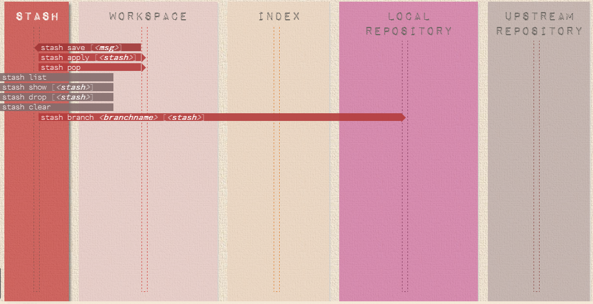

[TOC]

# Git 常用命令介绍

> 在本章节，我们将重点介绍Git中的常用命令，以及这些命令到底做了些什么。我们将按照工作空间（Workspace）、暂存区（Index）、本地仓库（Local Repository）、远程仓库（Remote Repository）和存档库（Stash）来逐类介绍Git常用命令，关于这几个区的介绍，请参考[01_基本介绍.md](01_基本介绍.md)。

## 参考资料

[Git Cheatsheet](http://ndpsoftware.com/git-cheatsheet.html#loc=workspace;)

## 工作空间（Workspace）

Workspace相关的命令如下图所示：


+ **git status**：查看当前工作空间的文件状态。文件一共有四种状态：untracked（还没有添加到库中的新文件），modified（被修改但还没添加到暂存区中的文件），staged（已添加到暂存区中但还没添加到仓库中的文件）和unmodified（自上次提交以来一直没有修改的文件，clean!）。

+ **git diff**：直接使用`git diff`命令，它将显示工作空间和暂存库之间的差异。也就是修改后还没有`git add` 到暂存区的内容。它还有以下几种用法：

  ```
  git diff    #[workspace vs index]查看尚未暂存的文件更新了哪些部分
  git diff filename 	#[workspace vs index on specific file]查看尚未暂存的某个文件更新了哪些
  git diff HEAD #[workspace vs HEAD] 显示工作空间和HEAD的差别
  git diff –-cached    #[index vs HEAD]查看已经暂存起来的文件和上次提交的版本之间的差异
  git diff –-cached filename #[index vs HEAD on specific file]查看已经暂存起来的某个文件和上次提交的版本之间的差异
  git diff ffd98b291e0caa6c33575c1ef465eae661ce40c9 b8e7b00c02b95b320f14b625663fdecf2d63e74c #[commitA vs commitB]查看某两个版本之间的差异
  git diff ffd98b291e0caa6c33575c1ef465eae661ce40c9:filename b8e7b00c02b95b320f14b625663fdecf2d63e74c:filename   #[commitA:filename vs commitB:filename]查看某两个版本的某个文件之间的差异
  git diff branch1 branch2 #[branch1 vs branch2]直接将两个分支上最新的提交做diff
  ```

+ **git add**：将当前工作空间的修改提交到暂存区中。用户可以使用`git add -i`来交互式的操作要添加到暂存区的文件。

  ```
  git add -a #添加所有modified/untracked类型的文件。
  git add -u #添加所有modified类型文件（untracked类型除外）。
  git add -i #--revert 子命令是把已经添加到暂存库中的文件从暂存库中剔除。
  git add -i #--update子命令是将modified文件添加到暂存库中。
  git add -i #--add untracked子命令是将untracked文件添加到暂存库中。
  ```

+ **git rm**：删除当前工作空间或者暂存区中的文件。

  ```
  # git rm fileName #删除当前工作空间中的某个文件
  # git rm --cached fileName #删除暂存区中的某个文件
  ```

+ **git mv**：移动工作空间或者暂存区中的文件。

+ **git checkout**：迁出新的分支或文件。

  ```
  git checkout branchName #[branch switch]切换到branchName分支，更新HEAD以指向branch分支以及用branch指向的树更新暂存区和工作区。
  git checkout -b branchName #[branch create and switch]创建并切换到新的分支branchName
  git checkout -- fileName #[index -> workspace on specific file]用暂存区中filename文件来覆盖工作区中的filename文件。
  git checkout -- . / git checkout . #[index -> workspace on all file] 会取消所有本地的修改（相对于暂存区）,相当于用暂存区的所有文件直接覆盖本地文件。
  git checkout branch -- filename #[branch:filename -> index & workspace:filename]维持HEAD的指向不变。用branch所指向的提交中filename替换暂存区和工作区中相应的文件。注意会将暂存区和工作区中的filename文件直接覆盖。
  ```

+ **git reset**：

  ```
  git reset [--hard|soft|mixed|merge|keep] [<commit>或HEAD] #将当前的分支重置到某次指定的commit,如果不显式的指定commit，默认是HEAD。根据中间参数的不同，workspace/index/local repository会有不同的改动。具体如下：
   -- hard:[回滚所有到commit状态] workspace重设workspace,index,HEAD到指定的commit。当前工作空间和index所有的更改都会被丢弃掉。
   -- soft:[回滚repo到index] 将HEAD重设到指定的commit,workspace和index保持不变，commit~HEAD之间的更改将添加到index中。 
   -- mixed:[回滚index staged到modified/untracked]清空已经提交到index中的文件，workspace和HEAD均保持不变。这个模式的效果是，working directory中文件的修改都会被保留，不会丢弃，但是也不会被标记成"Changes to be committed"。如果不加参数，默认是这个参数。
  ```

## 暂存区（Index）


+ **commit**：提交暂存区内容到本地仓库。

## 本地仓库（Local Repository）


## 远程仓库（Remote Repository）


+ **git remote**：连接远程仓库。

  ```
  git remote #列出所有远程仓库的名字
  git remote -v #列出所有远程仓库的名字和地址
  git remote add origin git:XXX.git #添加远程仓库origin,其地址为git:XXX.git
  ```

  ​

+ **git fecth**：将远程仓库的内容取到本地。

  ```
  git fetch #这将更新git remote 中所有的远程repo 所包含分支的最新commit-id, 将其记录到.git/FETCH_HEAD文件中
  git fetch remote_repo #这将更新名称为remote_repo 的远程repo上的所有branch的最新commit-id，将其记录。 
  git fetch remote_repo remote_branch_name #这将这将更新名称为remote_repo 的远程repo上的分支： remote_branch_name
  git fetch remote_repo remote_branch_name:local_branch_name #这将这将更新名称为remote_repo 的远程repo上的分支： remote_branch_name ，并在本地创建local_branch_name 本地分支保存远端分支的所有数据。
  ```

+ **git pull**： 首先，基于本地的FETCH_HEAD记录，比对本地的FETCH_HEAD记录与远程仓库的版本号，然后git fetch 获得当前指向的远程分支的后续版本的数据，然后再利用git merge将其与本地的当前分支合并。

## 存档库（Stash）



+ **git stash**：临时存储Workspace和Index中的内容。

  ```
  git stash  #将当前分支的内容保存到存档库中
  git stash apply #将刚刚保存的内容提取出来，继续开发
  ```

  ​