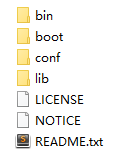

[TOC]

# Maven 介绍

> 本章节主要介绍Maven的特性和用法。以POM文件作为主线，介绍Maven的使用规则，中间穿插讲解settings.xml文件的配置。 更多关于Maven概念的介绍请参考[Maven概念详解](02_Maven概念详解.md)。

​	我们一直在寻找避免重复的方法。设计的重复（于是有Spring等优秀的框架）、编码的重复（于是有设计模式等）、文档的重复（于是有git等），当然还有构建的重复，于是有了Maven。Maven抽象出了一个完整的构建生命周期模型，并标准化了整个构建的过程，是一个优秀的跨平台的项目管理工具。

​        那么什么是构建呢？除了编写源码，我们每天有相当一部分的时间都花在了编译、运行单元测试、生成文档、打包和部署等工作上，这就是构建。Maven能够自动化构建过程，从清理、编译、测试到生成报告、打包和部署，我们只需要使用Maven配置好项目，即可自动化完成整个构建过程。

​        总体来说，Maven的优点有如下几点：

+ 跨平台。Maven是服务于基于Java平台的项目构建，因此也可以在多个系统上使用相同的命令。
+ 项目对象模型（Project Object Model,POM）。我们可以直接使用Maven插件来完成构建的各个阶段，甚至还可以自定义插件来完成某些特殊的需求。
+ 项目管理工具。通过POM文件可以方便管理项目依赖，而且丰富的Maven仓库方便用户使用和下载。

## 安装目录



Maven的安装目录如上图所示，这些文件的功能如下：

- bin： mvn和mvnDebug两个脚本存放位置，用来执行maven命令（本质是执行JAVA）。
- boot：仅包含plexus-classworlds-2.5.2.jar，是一个类加载器框架。
- conf：settings.xml全局配置文件就放在这里，用户使用时应该将这个文件拷贝到自己的.m2目录下定义局部的配置信息。
- lib：该目录包含了Maven运行时所需的Java类库，就是Maven自身代码都在这个包里。

## POM文件总览

​        POM文件是Maven管理项目的核心文件，一个简单的POM文件如下表所示，它是一个XML文件，根元素是`project`，`modelVersion`定义了当前POM模型的版本；`groupId`、`artifactId`和`version`定义了一个项目的基本坐标；`properties`定义了一些基本属性值，这些属性值会在该POM文件中使用；`dependencies`定义了该项目的依赖。

```xml
<?xml version="1.0" encoding="UTF-8"?>
<project xmlns="http://maven.apache.org/POM/4.0.0"
         xmlns:xsi="http://www.w3.org/2001/XMLSchema-instance"
         xsi:schemaLocation="http://maven.apache.org/POM/4.0.0 http://maven.apache.org/xsd/maven-4.0.0.xsd">
    <modelVersion>4.0.0</modelVersion>

    <groupId>com.duansky</groupId>
    <artifactId>flink.graphflow</artifactId>
    <version>1.0-SNAPSHOT</version>
    <name>FkGraphFlow</name>
  
    <properties>
        <flink-version>1.1.3</flink-version>
    </properties>

    <dependencies>
        <dependency>
            <groupId>junit</groupId>
            <artifactId>junit</artifactId>
            <version>4.11</version>
            <scope>test</scope>
        </dependency>
    </dependencies>
  
</project>
```

## 依赖（dependencies）

一个完整的项目依赖如下所示，更多的关于Maven坐标和依赖的解释，参见[Maven 概念详解](02_Maven概念详解.md)

```xml
<dependencies>
        <dependency>
            <groupId>org.springframework</groupId>
            <artifactId>spring-context</artifactId>
            <version>4.1.9.RELEASE</version>
            <type>jar</type>
            <scope>runtime</scope>
            <optional>false</optional>
            <exclusions>
                <exclusion>
                    ...
                </exclusion>
            </exclusions>
        </dependency>
</dependencies>
```

+ `groupId,artifactId,version`：依赖的基本坐标，必须提供。
+ `type`：依赖的类型，对应于项目坐标定义的packaging，大部分情况下不需要声明，默认为jar。
+ `scope`：依赖的范围。
+ `optional`：标记依赖是否是可选的。
+ `exclusions`：用来排除传递性依赖。

## 仓库（repositories）

​	坐标和依赖是任何一个Maven构件的逻辑表达方式，而构件的物理表达方式是文件，Maven是通过仓库来统一管理这些文件的。更多关于仓库的介绍，参见[Maven 概念详解](02_Maven概念详解.md)。一个远程仓库的配置如下所示。我们在`repositories`标签下配置若干个远程仓库的信息。

```xml
<repositories>
        <repository>
            <id>jboss-maven2-release-repository</id>
            <name>JBoss Repository</name>
            <url>http://repository.jboss.org/maven2/</url>
            <releases>
                <enabled>true</enabled>
                <updatePolicy>daily</updatePolicy>
                <checksumPolicy>fail </checksumPolicy>
            </releases>
            <snapshots>
                <enabled>false</enabled>
                <updatePolicy>daily</updatePolicy>
                <checksumPolicy>fail </checksumPolicy>
            </snapshots>
            <layout>default</layout>
        </repository>
</repositories>
```

+ `id`：唯一标识仓库的编号。中央仓库的id为central，如果其它仓库也是用这个ID，则会覆盖中央仓库。
+ `name`：仓库的通俗的名字。
+ `url`：仓库地址。
+ `releases`：仓库发布版本的配置信息，包括是否启用，检查构件更新的频率以及校验和失败后的处理方式等。
+ `snapshots`：仓库快照版本的配置信息，同样包括上述`releases`标签信息。

​        有时候这些远程仓库的服务器在国外，国内很难访问到或者访问较慢，因此在国内很多人搭建了这些远程仓库的镜像。用户通过访问这些镜像来下载构件速度更快。此外，如果将私服配置成所有远程仓库的镜像，也可以起到代理所有远程仓库的作用。镜像的配置在settings.xml文件中。配置方式如下：

```xml
<settings>
        ...
        <mirrors>
        	<mirror>
          		<id>maven.net.cn</id>
              	<name>one of the central mirrors in China</name>
              	<url>http://maven.net.cn/content/groups/public</url>
              	<mirrorOf>central</mirrorOf>
          	</mirror>
  		</mirrors>
</settings>
```

​        配置好远程仓库之后，我们可以从远程仓库中下载构件，那么如何将自己的构建上传到远程仓库中呢？上传构件到远程仓库采用如下的配置。

```xml
<distributionManagement>
        <repository>
            <id>pro-release</id>
            <name> project release repository</name>
            <url>http://133.133.10.1/content/repositories/proj-releases</url>
        </repository>
        <snapshotRepository>
            <id>pro-snapshots</id>
            <name> project snapshot repository</name>
            <url>http://133.133.10.1/content/repositories/proj-snapshots</url>
        </snapshotRepository>
</distributionManagement>
```

​	如果大家自写的构件都能够随意的上传到远程仓库，显然会造成构件难以维护、不安全等问题，因此需要进行认证，只有通过认证的机构或组织才能够将自己的构件上传到远程仓库以供其他人使用。认证机制不属于本项目中的内容，而且放在POM文件也不安全，因此Maven将远程仓库的认证方式放在了settings.xml配置文件中。采用如下方式进行配置。

```xml
<settings>
        ...
        <servers>
            <id>my-proj</id>
            <username>repo-user</username>
            <password>repo-pwd</password>
        </servers>
</settings>
```

+ `id`即为需要配置的远程仓库的唯一编号。

## 插件仓库（pluginRepositories）

​	构件有构件仓库，插件也有自己的插件仓库，用来存放各种插件。插件的仓库是通过标签`pluginRepositories`来配置的，如下所示：

```xml
<pluginRepositories>
        <pluginRepository>
            <id>central</id>
            <name>Maven Plugin Repository</name>
            <url>http://repo1.maven.org/maven2</url>
            <releases>
                <enabled>true</enabled>
                <updatePolicy>daily</updatePolicy>
                <checksumPolicy>fail </checksumPolicy>
            </releases>
            <snapshots>
                <enabled>false</enabled>
                <updatePolicy>daily</updatePolicy>
                <checksumPolicy>fail </checksumPolicy>
            </snapshots>
            <layout>default</layout>
        </pluginRepository>
</pluginRepositories>
```

## 插件（Plugin）

​	讲到Maven的插件，就不得不提Maven的生命周期。Maven的生命周期是为了对所有的构建过程进行抽象和统一。生命周期本身不做任何实际工作，实际的任务都是交由插件来完成的。更多关于生命周期的介绍，参见[Maven 概念详解：生命周期和插件（Lifecycle & Plugins）](02_Maven概念详解.md)。Maven插件的配置如下所示。

```xml
<build>
        <plugins>
            <plugin>
                <groupId>org.apache.maven.plugins</groupId>
                <artifactId>maven-shade-plugin</artifactId>
                <version>1.2.1</version>
                <executions>
                    <execution>
                        <phase>package</phase>
                        <goals>
                            <goal>shade</goal>
                        </goals>
                        <configuration>
                            <transformers>
                                <transformer implementation="org.apache.maven.plugins.shade.resource.ManifestResourceTransformer">
                                    <mainClass>com.duansky.learn.mvn.HelloWorld</mainClass>
                                </transformer>
                            </transformers>
                        </configuration>
                    </execution>
                </executions>
            </plugin>
        </plugins>
</build>
```

在POM文件的build元素下的plugins子元素下声明插件的使用。

+ `groupId,artifactId,version`：这三个元素来定位这个插件。
+ `executions`：用来配置一个具体的任务，每个任务的配置如下：
  + `phase`：对应到生命周期的哪个阶段。
  + `goals`：该插件的哪些功能将配置到该阶段。  

## 聚合（multi-module）

​	模块化是软件工程中一个重要的项目组织思想，我们将一个大的项目拆分成若干个子项目，每个子项目都是一个独立的模块，这些被聚合模块的聚合构建成最终的大项目。Maven是如何对应这种模块化的项目组织的呢？Maven使用聚合方式来管理各个模块。在Maven中我们可以定义一个聚合模块来将所有相关的子模块串起来，以达到构建聚合模块来一次性构建所有子模块的目的。更多关于聚合的介绍，参见[Maven 概念详解：聚合（multi-module）](02_Maven概念详解.md)。配置如下：

```xml
<project>
  	...
  	<packaging>pom</packaging>
  	<modules>
  		<module>account-email</module>
      	<module>account-persist</module>
  	</modules>
</project>
```

​	需要注意的是，聚合模块本身只是用来聚合若干个子模块用的，因此没有业务逻辑，其打包类型必须为POM。在指定了子模块之后，聚合模块是如何定位子模块的呢？Maven默认的查找方式是在当前聚合模块的子目录下查找的，即如何聚合模块POM的路径是D:\\...code\account-aggregator\pom.xml，那么子模块account-email的POM路径在D:\\...code\account-aggregator\account-email\pom.xml下，这就要求子模块必须放在聚合模块的子目录下。当然用户也可以不将子模块放在聚合模块的子目录下，无论放在哪里，关键是在module标签中指出子模块的POM文件路径。

## 继承（inheritance）

​	考虑到这样一种情况，在若干个模块中，这些模块都使用了相同的依赖，例如都使用JUnit进行单元测试，都使用了Spring Context框架等，如果每个模块都对这些依赖配置一遍就显得重复，那么如何消除这种重复配置呢？Maven使用类似于JAVA的继承思想来共享公共的配置，更多关于继承的介绍，参见[Maven 概念详解：继承（inheritance）](02_Maven概念详解.md)。父模块的配置如下：

```xml
<project>
	<groupId></groupId>
  	<artifactId></artifactId>
  	<version></version>
  	<packaging>pom</packaging>
</project>
```

+ `packaging`：需要将父模块的packaging标签值配置成POM。

子模块采用如下的配置来继承父模块：

```xml
<project>
  	<parent>
  		<groupId></groupId>
      	<artifactId></artifactId>
      	<version></version>
      	<relativePath></relativePath>
  	</parent>
  	...
</project>
```

当子模块继承父模块之后，子模块继承了父模块的哪些配置呢？继承的配置见如下列表：

|          POM元素           |               说明                |
| :----------------------: | :-----------------------------: |
|       **groupId**        |              项目组ID              |
|       **version**        |              项目版本               |
|       description        |             项目描述信息              |
|       organization       |             项目的组织信息             |
|      inceptionYear       |             项目的创始年份             |
|           url            |            项目的URL地址             |
|        developers        |            项目的开发者信息             |
|       contributors       |            项目的贡献者信息             |
|  distributionManagement  |             项目部署配置              |
|     issusManagement      |           项目缺陷跟踪系统信息            |
|       ciManagement       |           项目的持续集成系统信息           |
|           scm            |           项目的版本控制系统信息           |
|       mailingLists       |            项目的邮件列表信息            |
|      **properties**      |           自定义的Maven属性           |
|     **dependencies**     |             项目的依赖配置             |
| **dependencyManagement** |            项目的依赖管理配置            |
|       repositories       |             项目的仓库配置             |
|        **build**         | 包括项目的源码目录配置、输出目录配置、插件配置、插件管理配置等 |
|        reporting         |      包括项目的报告输出目录配置、报告插件配置等      |


​	通过观察上表我们发现子模块会同时继承父模块的dependencies和dependencyManagement，这两个有什么区别呢？考虑这样一种情况，对于若干个子模块，有的子模块用到了spring-context等组件，有的子模块仅仅用到了JUnit等组件，如果把这些组件都配置到父模块的dependencies中，那么所有的子模块都会继承，不管这些子模块是否真正使用。这样的无用继承显然不太合理，于是有了dependencyManagement标签，当用户在父模块的dependencyManagement标签配置依赖时，子模块只有在自己的dependencies中真正配置了相关的依赖，才会将其真正在dependencyManagement中的依赖继承过来，如果没有使用某些依赖，即使在dependencyManagement中已经定义了，仍然不会被继承。这种灵活的方式一是解决了上述所说的继承无用依赖的问题，另外一方面我们可以在dependencyManagement中定义好所有子项目所需的依赖组件和对应的版本，以避免不同的子模块使用同一依赖的不同版本问题。

​	对于bulid标签下的pluginManagement的使用规则同dependencyManagement使用规则一样。

