[TOC]

# Maven概念详解

> 本章节主要介绍Maven的重要概念，包括坐标、依赖、仓库、生命周期和插件、聚合和继承等。

## 参考资料

[Maven实战]()

http://www.cnblogs.com/woms/p/5769878.html

## 坐标

​        Maven定义了这样一组规则：世界上任何的构件都可以通过Maven的坐标进行唯一的标识，我们只要提供正确的坐标元素，就可以找到对应的构件。这组坐标元素包括：groupId，artifactId，version，package，classifier，**前三个是必须定义的，后两个是可选的。**示例如下：

```xml
<groupId>org.springframework</groupId>
<artifactId>spring-context</artifactId>
<version>4.1.9.RELEASE</version>
```

- `groupId`：定义了当前Maven项目隶属的实际项目，如SpringFramework这一实际项目对应的Maven项目会有很多，如spring-core，spring-context等。这事由于Maven中模块的概念，因此一个实际项目可能会被拆成若干个模块。需要注意的是，groupId不应该对应项目隶属的组织或公司，因为一个组织下可能有很多实际项目。
- `artifactId`：定义了实际项目中的一个模块，推荐做法是使用实际项目名作为artifactId的前缀，这样方便寻找构件。
- `version`：该模块所处的版本。
- `packaging`：该元素定义了模块的打包方式，默认是以jar格式打包，还可以定义其他的如war格式打包。
- `classifier`：该元素用来帮助定义构建输出的一些附属构件。附属构件与主构件对应，如主构件是spring-context-4.1.9.RELEASE.jar，该项目可能通过一些插件生成如spring-context-4.1.9.RELEASE-javadoc.jar、spring-context-4.1.9.RELEASE-sources.jar这样的一些附属构件，其中包含了java文档和源码。这是javadoc和sources就是这两个附属构件的classifier。需要注意的是不能直接定义项目的classfier，因为附属构件不是项目直接生成的，而是由附加的插件帮助生成的。

项目构件的文件名也是和坐标对应的，一般规则为`artifactId-version[-classfier].packaging`

## 依赖

​        在本节中，我们将重点讲解Maven中的依赖。官方文档参见[Introduction to the Dependency Mechanism](http://maven.apache.org/guides/introduction/introduction-to-dependency-mechanism.html)。

### 依赖配置

​        根元素project下的dependencies标签囊括了该项目所有的依赖。一个常见的依赖如下所示，针对某个元素的具体含义请参考对应的章节。

```xml
<project>
  ...
  <dependencies>
          <dependency>
              <groupId>org.springframework</groupId>
              <artifactId>spring-context</artifactId>
              <version>4.1.9.RELEASE</version>
              <type>jar</type>
              <scope>runtime</scope> 
              <optional>false</optional>
              <exclusions>
                  <exclusion>
                      ...
                  </exclusion>
              </exclusions>
          </dependency>
  </dependencies>
</project>
```

​        通过上述方式引入依赖之后，可能存在这样的问题。A -> B，B -> C，那么A和C是什么关系呢？这就要用到Maven的**传递依赖**（Transitive Dependencies）特性，但在正式讲解传递依赖之前，我们先弄明白依赖范围的概念。

### 依赖范围（scope）

​        所谓的依赖范围，是指当前的这个依赖的生命周期（是在编译时、测试时还是运行时等）。Maven总共提供了三种不同的classpath：（1）在编译项目的主代码时需要使用一套classpath；（2）在编译和执行测试时需要使用另一套classpath；（3）在实际运行Maven项目的时候又会使用一套classpath。**依赖范围就是控制依赖和这三种classpath（编译classpath、测试classpath、运行classpath）的关系。**Maven总共有如下几种依赖范围：

​:black_large_square: **compile**：编译依赖范围。没有指定依赖范围时默认使用该依赖范围，对于使用该依赖范围的Maven依赖，对于编译、测试和运行三种classpath都有效。

​:black_large_square: **test**：测试依赖范围。使用此依赖范围的Maven依赖，仅仅对测试有效，对主代码没有任何影响。例如使用JUnit，只有在测试的时候才使用。

​:black_large_square: **provided**：已提供依赖范围。对编译和测试有效，对运行无效。典型的例子就是servlet-api，编译和测试项目的时候需要使用该依赖，但在运行项目的时候，由于容器已经提供，就不需要Maven重复的引入一遍。

​:black_large_square: **runtime**： 运行时依赖范围。对测试和运行有效，但在编译主代码时无效。典型的例子就是JDBC驱动的实现，项目主代码编译只需要JDK提供JDBC的接口，只有在执行测试或者运行项目的时候才需要实现上述接口的具体JDBC驱动。

​:black_large_square: **system**：系统依赖范围。该依赖范围和provided一致，区别在于使用system的依赖范围必须通过`systemPath`元素来显式的指定依赖文件路径。此类依赖不是通过Maven仓库解析的，是本地化的引入构建，因此可能会造成构建不可移植，应该谨慎使用。

​:black_large_square: **import**：导入依赖范围。该依赖范围只有在dependencyManagement标签下才有效，目的是通过将目标POM的dependencyManagement配置导入并合并到当前POM的dependencyManagement中。

<center>依赖范围与classpath关系</center>

|   依赖范围   |  编译  |  测试  |  运行  |     实例      |
| :------: | :--: | :--: | :--: | :---------: |
| compile  |  √   |  √   |  √   | spring-core |
|   test   |      |  √   |      |    JUnit    |
| provided |  √   |  √   |      | servlet-api |
| runtime  |      |  √   |  √   |  JDBC 驱动实现  |
|  system  |  √   |  √   |      |     本地的     |

### 传递依赖（Transitive Dependencies）

​        考虑一个Maven项目A有一个compile范围的B依赖，B也有一个compile范围的C依赖，那么C就会成为A的compile范围依赖，此时C是A的**传递性依赖**。有了传递依赖的性质，当A引入B时，就不需要考虑B又引入了什么构件，Maven会解析各个直接依赖的POM，将那些间接依赖以传递性依赖的方式引入到当前的项目中。

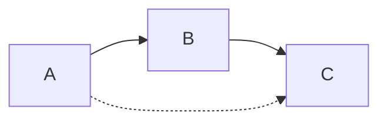

​        我们假设A依赖于B，B依赖于C，我们说A对B是第一直接依赖，B对C是第二直接依赖，A对C是传递性依赖。第一直接依赖的范围和第二直接依赖的范围决定了传递依赖的范围。关系如下表所示，左列为第一直接依赖范围，上行为第二直接依赖范围，中间为传递依赖范围。

|              | compile  | test | provided | runtime  |
| :----------: | :------: | :--: | :------: | :------: |
| **compile**  | compile  |  -   |    -     | runtime  |
|   **test**   |   test   |  -   |    -     |   test   |
| **provided** | provided |  -   | provided | provided |
| **runtime**  | runtime  |  -   |    -     | runtime  |

​	通过这种传递依赖的方式，非常方便的将相关的依赖都引入进来，但也带来很多问题，如引入的包过多甚至重复等问题，为了解决这些问题，Maven提供了相关的解决方案，我们将在接下来的几节中讲解。

### 依赖调解（Dependency Mediation）

​	假设项目A的依赖关系如下所示，那么哪个版本的X将会被引入到项目中呢？

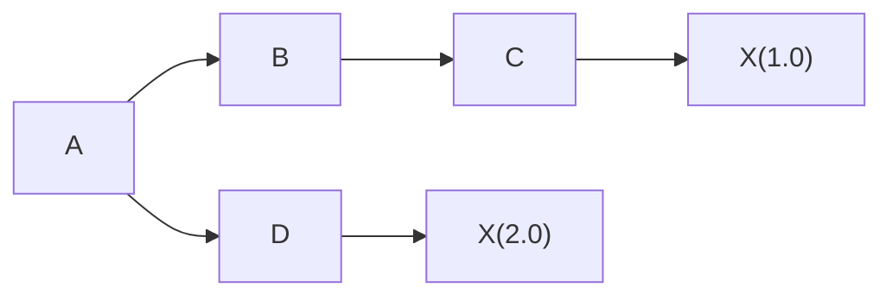

​	Maven是采用==路径最近者优先原则==，在依赖树中，`X(2.0)`比`X(1.0)`更接近A，因此会将`X(2.0)`引入进来；当两者的路径相同时，Maven有采用了==第一声明者优先原则==，在依赖路径长度相同情况下，在POM中依赖声明的顺序决定了谁先会被解析使用，顺序最靠前的那个依赖优胜。

### 可选依赖（Optional）

​	假设项目A的依赖关系如下所示，X和Y是B的两个可选依赖。

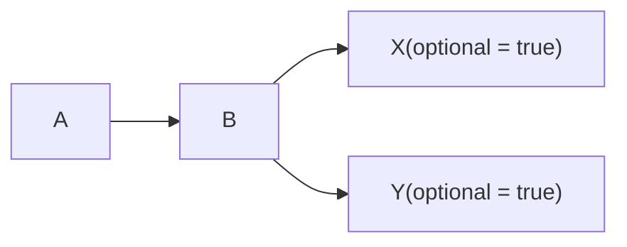

​	既然X和Y是B的两个可选依赖（可要可不要），那么依赖将不会传递，即X、Y不会对A有任何影响。那为什么还要有这样的依赖呢？考虑到这样一种情况，B实现了两个特性，这两个特性一个依赖于X，一个依赖于B，而且这两个特性是互斥的，用户不可能同时使用这两个特性，比如B是一个持久层隔离包，它支持多种数据库，包括MySQL，PostgreSQL等，在构建这个工具包的时候，需要这两种数据库的驱动程序，但在使用这个工具包的时候，只会依赖一种数据库。那么在A使用B时，可以显示的声明需要使用具体哪一个依赖。

### 排除依赖（Exclusions）

​        考虑这样一种情况，项目A引入了依赖B，而B又引入了一个不稳定的C，那么这个不稳定的C肯定会影响到项目A；又或者项目A想引入自己的C，而不想使用B所依赖的C的版本；Maven使用排除依赖来解决这类问题。在引入包的时候，我们可以显示的说明不想引入这个包的某个依赖，如下图所示。

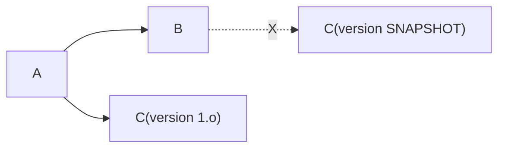

## 仓库

### 仓库分类

​	Maven通过仓库来管理构件。Maven仓库分为本地仓库和远程仓库。在使用的时候一般是先在本地仓库查找，如果没有找到就到远程仓库中下载。仓库的分类如下图所示。

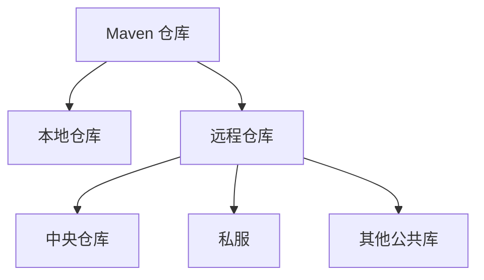

​	中央仓库是Maven自带的核心的远程仓库，包含了绝大部分开源的构件。私服是用户自己在局域网内搭建的私有的仓库服务器，用来代理对外部远程仓库的访问，用户也可以将自己写的构件上传到私服供公司内其他同事使用，非常方便。私服的定位可以用如下图表示。私服通过缓存大量的公用的构件，节省了带宽，也减少了中央仓库的压力。

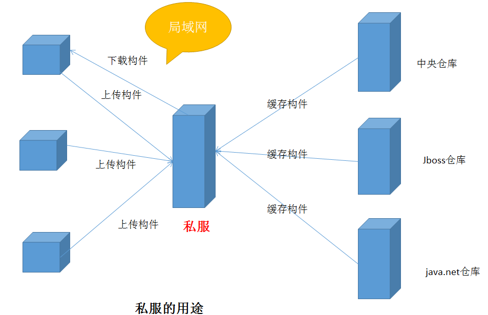


### 发布版本和快照版本（RELEASE VS SNAPSHOT）

参考资料：http://yongpoliu.com/snapshot-vs-release/

​	在maven的约定中，依赖的版本分为两类——SNAPSHOT和RELEASE。SNAPSHOT依赖泛指以-SNAPSHOT为结尾的版本号，例如1.0.1-SNAPSHOT。除此之外，所有非-SNAPSHOT结尾的版本号则都被认定为RELEASE版本，即正式版，虽然会有beta、rc之类说法，但是这些只是软件工程角度的测试版，对于maven而言，这些都是RELEASE版本。既然Maven提供了这两类版本号，那么他们之前的优劣势是什么？分别在什么场景下使用？

（1）SNAPSHOT

​	同一个SNAPSHOT版本的依赖可以多次发布（deploy）到仓库中，也就是说同一个SNAPSHOT版本的依赖可以在仓库中存在多份，每一份都是代码在某一个特定时间的快照，这也是SNAPSHOT的含义。

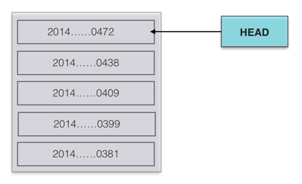

​	如上图，很好地表达了SNAPSHOT的细节，也阐述了一个SNAPSHOT很重要观点——SNAPSHOT不是一个特定的版本，而是一系列的版本的集合，其中HEAD总是指向最新的快照，对外界可见的一般也是最新版，这种给人的假象是新的覆盖了老的，从而使得使用SNAPSHOT依赖的客户端总是通过重新构建（有时候需要-U强制更新）就可以拿到最新的代码。例如：A-->B-1.3.8-SNAPSHOT（理解为A依赖了B的1.3.8-SNAPSHOT版本），那么B-1.3.8-SNAPSHOT更新之后重新deploy到仓库之后，A只需要重新构建就可以拿到最新的代码，并不需要改变依赖B的版本。由此可见，这样达到了变更传达的透明性，这对于开发过程中的团队协作的帮助不言而喻。

​	SNAPSHOT版本的依赖因为存在变更传达的透明性的优势而被赏识，这样对于变更直接生效，很方便。但变更就意味着风险，透明性更是把风险彻底隐藏了起来。例如：A-->B.1.0.3-SNAPSHOT，B对一个A使用的功能实现进行了调整，直接发布到仓库，A重新构建或许就会失败，更糟糕的是构建成功，运行时异常。这个时候A甚至完全没有代码变更就突然失败了，会带来更多的困惑。

（2）RELEASE

​	RELEASE版本和SNAPSHOT是相对的，非SANPSHOT版本即RELEASE版本，RELEASE版本是一个稳定的版本号，看清楚是一个，不是一系列，可以认为RELEASE版本是不可变化的，一旦发布，即永远不会变化。

> ​:anchor: 在开发期间，活跃模块的版本号使用SNAPSHOT，在生产期间，依赖RELEASE版本模块。

## 生命周期和插件（Lifecycle & Plugins）

### 生命周期（Lifecycle ）	

​	Maven的生命周期是为了对所有的构建过程进行抽象和统一。Maven从大量的项目和构建工具中学习和反思，然后总结了一套高度完善的、可扩展的**生命周期**。这个生命周期包括项目的**清理、初始化、编译、测试、打包、集成测试、验证、部署和站点生成**等几乎所有的构建步骤。几乎所有的项目构建，都可以映射到这个生命周期上。

​	生命周期本身不做任何实际工作，实际的任务都是交由插件来完成的。每个构建步骤都可以绑定一个或多个插件行为，Maven为大多数构建步骤提供并绑定了默认的插件，当用户有特殊需要的时候，也可以配置插件定制构建行为，甚至可以自己编写插件。

Maven提供了三套独立的生命周期：clean（清理项目），default（构建项目），site（建立站点），每个生命周期又包含若干个有序的阶段（phase），如下图所示。

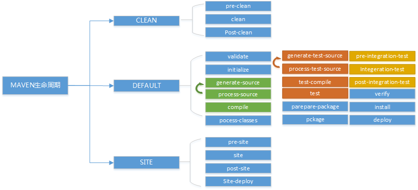

我们常用的命令是如何与上述的生命周期对接的呢？

+ **$mvn clean**：该命令是调用clean生命周期的pre-clean和clean阶段。
+ **$mvn test**：该命令调用default生命周期的validate到test阶段。
+ **$mvn clean install**：该命令调用了clean生命周期的pre-clean和clean阶段以及default生命周期的validate到install阶段。
+ **$mvn clean deploy site-deploy**：该命令调用了clean生命周期的pre-clean和clean阶段、default生命周期的validate到deploy阶段以及site生命周期的pre-site到site-deploy阶段。

### 插件目标（Plugin Goal）

​	一个插件可能完成很多事情，如maven-dependency-plugin插件可以分析项目依赖，也可以以树型结构展示项目依赖，这里的每一个功能都对应了一个插件目标。使用规则是`dependency:list`，即`插件名：插件目标`。

### 生命周期和插件之间绑定

​        在前面我们已经说了生命周期只是一个抽象的概念，具体的执行还是要依赖插件。那么生命周期的各个阶段是如何跟插件进行绑定的呢？Maven内置的绑定关系如下所示，当然用户可以通过插件配置标签来自定义绑定。

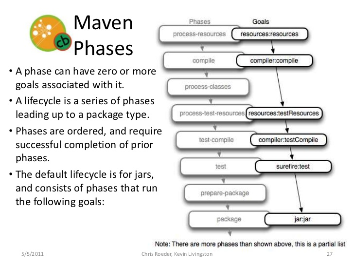

## 聚合和继承

### 聚合（multi-module）

​	模块化是软件工程中一个重要的项目组织思想，我们将一个大的项目拆分成若干个子项目，每个子项目都是一个独立的模块，这些被聚合模块的聚合构建成最终的大项目。Maven是如何对应这种模块化的项目组织的呢？Maven使用聚合方式来管理各个模块。

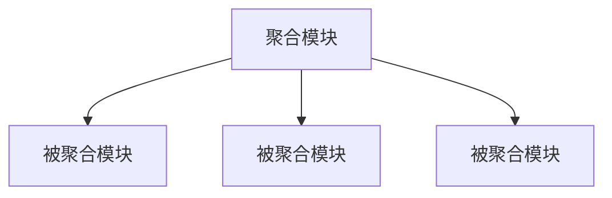

​	一般来说，聚合模块只负责聚合各个被聚合模块，本身是没有业务逻辑的。因此可以用一个POM文件来表示聚合模块，并且在该POM文件中声明其被聚合模块有哪些，这样Maven在解析项目的时候就会逐个找到其被聚合模块并逐个解析。那么我们可以通过一键构建聚合模块来达到构建所有被聚合模块的目的，而不需要一个一个的去构建被聚合模块，使用起来非常方便。按照这种组织方式，聚合模块可以作为根目录，被聚合的模块可以放在聚合模块目录下，采用如下图的组织方式。当然也可以不这么做，关键在于聚合模块的modules标签中指定好被聚合模块的位置。

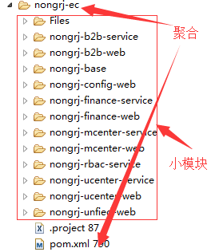

### 继承（inheritance）

​	考虑到这样一种情况，在若干个模块中，这些模块都使用了相同的依赖，例如都使用JUnit进行单元测试，都使用了Spring Context框架等，如果每个模块都对这些依赖配置一遍就显得重复，那么如何消除这种重复配置呢？Maven使用类似于JAVA的继承思想来共享公共的配置。我们可以采用如下图来表示：

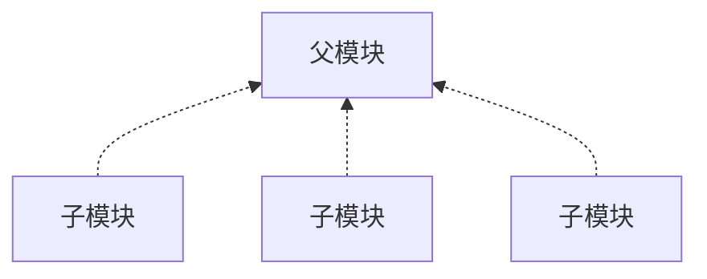

​	有了继承的机制，我们就可以在父POM中声明一些公共的配置供子POM继承，以实现"一处声明，多处使用"的目的。和聚合一样，父模块只是提供了公共的配置给子模块使用，因此父模块本身也没有业务逻辑，只是一个单独的POM。我们在子模块中使用parent标签来表明其父模块是谁，如何导航到父模块。

​	讲到这里，就不得不提Maven的超级POM。超级POM在`$MAVEN_HOME/lib/maven-model-builder-x.x.x.jar`中的`org/apache/maven/model/pom-4.0.0.xml`路径下。其POM定义了一些诸如中央仓库、插件仓库、默认的编译输出、打包输出地址等一些属性，这些属性可以认为是maven的一个约定。这也是Maven提倡的"**约定由于配置**"（Convention Over Configuration）的设计理念之一。

```xml
<project>
  <modelVersion>4.0.0</modelVersion>

  <repositories>
    <repository>
      <id>central</id>
      <name>Central Repository</name>
      <url>https://repo.maven.apache.org/maven2</url>
      <layout>default</layout>
      <snapshots>
        <enabled>false</enabled>
      </snapshots>
    </repository>
  </repositories>

  <pluginRepositories>
    <pluginRepository>
      <id>central</id>
      <name>Central Repository</name>
      <url>https://repo.maven.apache.org/maven2</url>
      <layout>default</layout>
      <snapshots>
        <enabled>false</enabled>
      </snapshots>
      <releases>
        <updatePolicy>never</updatePolicy>
      </releases>
    </pluginRepository>
  </pluginRepositories>

  <build>
    <directory>${project.basedir}/target</directory>
    <outputDirectory>${project.build.directory}/classes</outputDirectory>
    <finalName>${project.artifactId}-${project.version}</finalName>
    <testOutputDirectory>${project.build.directory}/test-classes</testOutputDirectory>
    <sourceDirectory>${project.basedir}/src/main/java</sourceDirectory>
    <scriptSourceDirectory>${project.basedir}/src/main/scripts</scriptSourceDirectory>
    <testSourceDirectory>${project.basedir}/src/test/java</testSourceDirectory>
    <resources>
      <resource>
        <directory>${project.basedir}/src/main/resources</directory>
      </resource>
    </resources>
    <testResources>
      <testResource>
        <directory>${project.basedir}/src/test/resources</directory>
      </testResource>
    </testResources>
    <pluginManagement>
      <!-- NOTE: These plugins will be removed from future versions of the super POM -->
      <!-- They are kept for the moment as they are very unlikely to conflict with lifecycle mappings (MNG-4453) -->
      <plugins>
        <plugin>
          <artifactId>maven-antrun-plugin</artifactId>
          <version>1.3</version>
        </plugin>
        <plugin>
          <artifactId>maven-assembly-plugin</artifactId>
          <version>2.2-beta-5</version>
        </plugin>
        <plugin>
          <artifactId>maven-dependency-plugin</artifactId>
          <version>2.8</version>
        </plugin>
        <plugin>
          <artifactId>maven-release-plugin</artifactId>
          <version>2.3.2</version>
        </plugin>
      </plugins>
    </pluginManagement>
  </build>

  <reporting>
    <outputDirectory>${project.build.directory}/site</outputDirectory>
  </reporting>

  <profiles>
    <!-- NOTE: The release profile will be removed from future versions of the super POM -->
    <profile>
      <id>release-profile</id>

      <activation>
        <property>
          <name>performRelease</name>
          <value>true</value>
        </property>
      </activation>

      <build>
        <plugins>
          <plugin>
            <inherited>true</inherited>
            <artifactId>maven-source-plugin</artifactId>
            <executions>
              <execution>
                <id>attach-sources</id>
                <goals>
                  <goal>jar</goal>
                </goals>
              </execution>
            </executions>
          </plugin>
          <plugin>
            <inherited>true</inherited>
            <artifactId>maven-javadoc-plugin</artifactId>
            <executions>
              <execution>
                <id>attach-javadocs</id>
                <goals>
                  <goal>jar</goal>
                </goals>
              </execution>
            </executions>
          </plugin>
          <plugin>
            <inherited>true</inherited>
            <artifactId>maven-deploy-plugin</artifactId>
            <configuration>
              <updateReleaseInfo>true</updateReleaseInfo>
            </configuration>
          </plugin>
        </plugins>
      </build>
    </profile>
  </profiles>

</project>
```


### 聚合 VS 继承

​	用如下的图来说，就是聚合和继承这两个概念毫无关系。聚合的出发点是通过一个聚合模块将若干个被聚合的模块串起来，以便通过构建聚合模块达到构建所有相关的被聚合模块的目的，方便用户对多个模块的统一构建。继承的出发点是消除子模块之间的重复配置，我们可以将多个子模块的公共配置放到父模块中进行统一的管理。虽然两者的目标不同，但往往会结合起来使用，即一个模块可能既作聚合模块又做父模块：既能够将所有相关的子模块串起来，又能够为这些子模块提供公共配置。

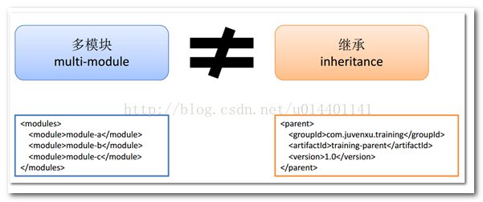

​	既然Maven项目有聚合和继承两种关系，那么在构建项目的时候，这么多个相关的项目是如何进行构建的呢？这里得介绍**反应堆**（Reactor）概念。反应堆是指所有模块组成的一个构建结构。对于单模块的项目，反应堆就是构建本身，对于多个模块来说，反应堆就是这些模块之间的继承和依赖关系。Maven能够从这些关系中自动计算合理的模块构建顺序。如下图所示：

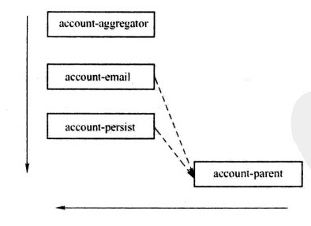

​	Maven自上而下的读取POM文件，如果该POM没有依赖模块，则直接构建该模块，如果有，则先构建依赖模块，如果依赖模块还依赖其他模块，则先构建其他模块。模块的依赖关系会将反应堆构成一个有向无环图（Directed Acyclic Graph，DAG），如果出现了循环依赖就会报错。

## 版本管理 